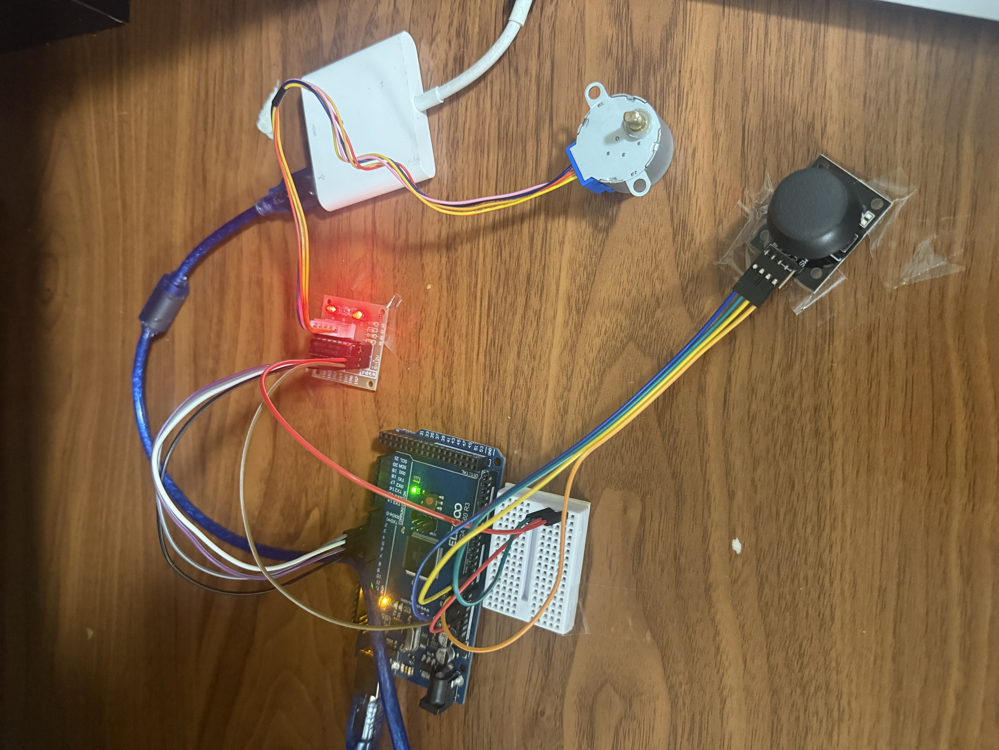

# 🎮 Joystick-Controlled Stepper Motor (Arduino + 28BYJ-48)

  
*Joystick controlling a 28BYJ-48 stepper motor via ULN2003 driver and Arduino UNO.*

---

## 📖 Project Overview
This project demonstrates **interactive motor control** using an **Arduino UNO**, a **28BYJ-48 stepper motor with ULN2003 driver**, and a **joystick module**.  

By moving the joystick left or right:
- The stepper motor spins **clockwise or counterclockwise**  
- The longer you hold the joystick, the motor accelerates faster until you release  
- Letting go immediately stops the motor  

This mimics a **game controller throttle** and is a fun way to learn about **analog input, motor drivers, and acceleration logic**.

---

## ⚡ Features
- Joystick directly controls stepper motor speed and direction  
- Deadzone filtering (prevents jitter when stick is centered)  
- Acceleration-based control: hold to speed up, release to stop  
- Simple, clean Arduino sketch with `AccelStepper` library  

---

## 🛠️ Components Used
- Arduino UNO R3 (Elegoo kit)  
- Stepper motor **28BYJ-48** (5V)  
- **ULN2003 driver board**  
- Joystick module (VRx, VRy, SW, VCC, GND)  
- Jumper wires + breadboard  
- USB cable for Arduino  

---

## 🔌 Wiring Diagram
```text
[ Arduino UNO ]         [ Joystick ]          [ ULN2003 Driver ] → [ Stepper Motor ]
-----------------------------------------------------------------------------------
5V --------------------> VCC
GND -------------------> GND
A0 --------------------> VRx
A1 --------------------> VRy (not used in this project)
D2 -----------------------------------------------------------> IN1
D3 -----------------------------------------------------------> IN2
D4 -----------------------------------------------------------> IN3
D5 -----------------------------------------------------------> IN4
5V -----------------------------------------------------------> VCC
GND ----------------------------------------------------------> GND
```

---

## 💻 Arduino Code
```cpp
#include <AccelStepper.h>

// Stepper motor pins (28BYJ-48 with ULN2003 driver)
#define IN1 2
#define IN2 3
#define IN3 4
#define IN4 5

// IMPORTANT: 28BYJ-48 pin order for AccelStepper is IN1, IN3, IN2, IN4
AccelStepper stepper(AccelStepper::FULL4WIRE, IN1, IN3, IN2, IN4);

// Joystick pin
#define JOY_X A0

// Settings
const int DEADZONE = 80;       // ignore small joystick movement
const int MAX_SPEED = 2000;    // top motor speed (steps/sec)
const int ACCEL_STEP = 20;     // acceleration step size

int currentSpeed = 0;

void setup() {
  stepper.setMaxSpeed(MAX_SPEED);
}

void loop() {
  int x = analogRead(JOY_X) - 512;  // read joystick X, centered at 0

  if (abs(x) < DEADZONE) {
    // Joystick released → stop
    currentSpeed = 0;
  } else if (x > 0) {
    // Joystick right → accelerate clockwise
    currentSpeed += ACCEL_STEP;
    if (currentSpeed > MAX_SPEED) currentSpeed = MAX_SPEED;
  } else {
    // Joystick left → accelerate counterclockwise
    currentSpeed -= ACCEL_STEP;
    if (currentSpeed < -MAX_SPEED) currentSpeed = -MAX_SPEED;
  }

  stepper.setSpeed(currentSpeed);
  stepper.runSpeed();  // run motor at current speed
}
```

---

## 📹 Demonstration
🎥 Click on joystick_stepper_demonstration.move link above

---

## 📚 What I Learned
- How to read **analog joystick input** from Arduino  
- Using **deadzones** to eliminate jitter  
- Controlling a **stepper motor** with the `AccelStepper` library  
- Implementing an **acceleration-based control system** instead of direct mapping  

---

## 🚀 Future Improvements
- Add an **OLED display** to show current speed/direction  
- Use the **Y-axis** of the joystick for extra features (e.g., max speed scaling)  
- Add **gradual braking** instead of instant stop  
- Create a **3D-printed or cardboard housing** for a polished project demo  

---

## 🏷️ Tags
`Arduino` `Stepper Motor` `Joystick` `Electronics` `Elegoo` `Portfolio Project`
