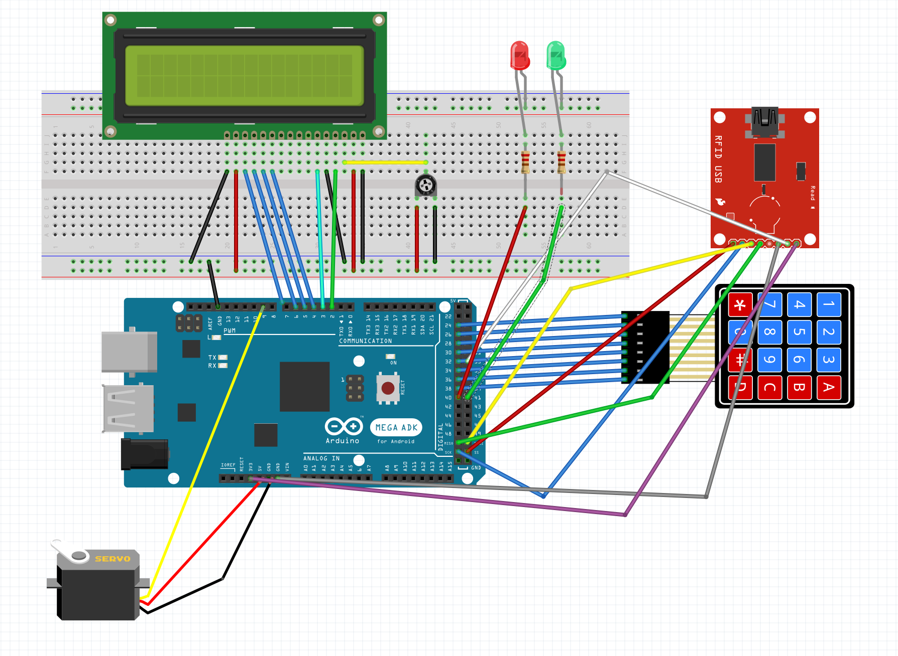
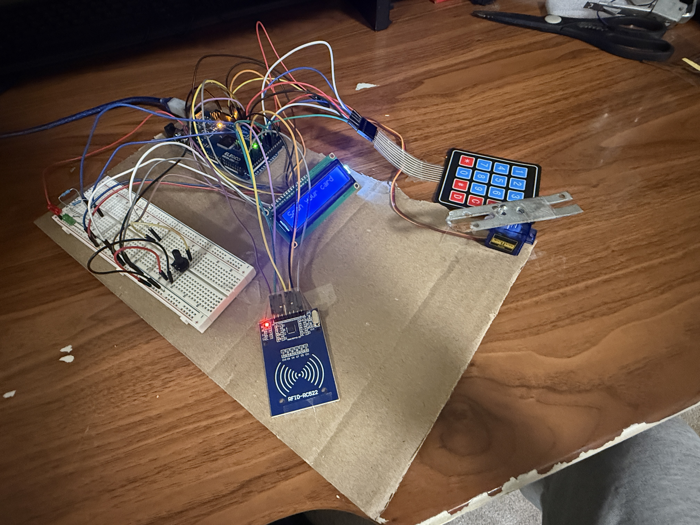

# 🔐 RFID + Keypad + Servo Secure Lock System (Arduino Mega)




## 🧠 Overview
This project combines **RFID**, **Keypad**, **LCD**, **LED indicators**, and a **Servo motor** to create a secure two-factor authentication lock using an **Arduino Mega 2560**.  
It uses both **RFID scanning** and a **password keypad** to unlock a servo-controlled mechanism (like a door latch).

> ⚠️ **Important:** I didn’t use the **I2C LCD module**, meaning the LCD is wired in **parallel mode** using six Arduino pins (RS, E, D4, D5, D6, D7).  
> This makes the wiring more complicated — so double-check every connection!

---

## ⚙️ Components Used
- Arduino Mega 2560  
- RC522 RFID Module  
- 16x2 LCD Display (non-I2C)  
- SG90 Servo Motor  
- 4x4 Matrix Keypad  
- Red and Green LEDs  
- Jumper wires and Breadboard  

---

## 🧩 Pin Configuration

| Component | Pins | Description |
|------------|------|-------------|
| **RFID (RC522)** | SS = 53, RST = 31 | SPI interface |
| **LCD (16x2)** | RS,E,D4–D7 = 2–7 | Parallel wiring (no I2C) |
| **Servo Motor** | 9 | Lock control |
| **Green LED** | 41 | Access granted indicator |
| **Red LED** | 40 | Access denied indicator |
| **Keypad** | Rows: 24,26,28,30<br>Cols: 32,34,36,38 | 4x4 keypad input |

---

## 🔑 Default Password

---

## 💡 Features
- ✅ Dual security: RFID + Keypad  
- ✅ Servo unlocks automatically for 3 seconds  
- ✅ LCD feedback (non-I2C wired manually)  
- ✅ LED indicators for access status  
- ✅ Works fully offline on Arduino Mega  

---

## 🧾 Required Libraries
Install these libraries in Arduino IDE:
- `MFRC522`
- `LiquidCrystal`
- `Servo`
- `Keypad`

---

## 🧰 Working Principle
1. Scan your **RFID card**.  
   - If valid → move to password screen  
   - If invalid → “Invalid Card” message  
2. Enter your **4-character password** (`1 2 3 A`).  
3. If both match → green LED turns on, servo unlocks, “Access Granted” shown.  
4. After 3 seconds → servo locks again and resets to “Scan your card”.

---

## 🧠 Notes
This project avoids pre-made LCD I2C modules — instead, each LCD pin is wired directly.  
It’s harder to wire but gives a much better understanding of how LCD signals work internally.

---

## 🧾 Full Arduino Code

```cpp
// RFID + LCD + Servo + LED + Keypad Secure Access System
// Board: Arduino Mega 2560
// RC522: SS=53, RST=31
// LCD: RS,E,D4,D5,D6,D7 = 2..7
// Servo: D9
// Green LED: D41, Red LED: D40
// Keypad (Left side 38,36,34,32 | Right side 30,28,26,24)
// Password: 1 2 3 A

#include <SPI.h>
#include <MFRC522.h>
#include <LiquidCrystal.h>
#include <Servo.h>
#include <Keypad.h>

// ----- RFID -----
#define SS_PIN 53
#define RST_PIN 31
MFRC522 mfrc522(SS_PIN, RST_PIN);

// ----- LCD -----
LiquidCrystal lcd(2, 3, 4, 5, 6, 7);

// ----- Servo -----
Servo myservo;
const int servoPin = 9;
const int closedPos = 90;
const int openPos = 180;
const unsigned long openDuration = 3000;

// ----- LEDs -----
const int greenLED = 41;
const int redLED = 40;

// ----- Authorized RFID UID -----
byte validUID[] = {0x13, 0x2D, 0xFA, 0x1F}; // white card

// ----- Keypad -----
const byte ROWS = 4;
const byte COLS = 4;
char keys[ROWS][COLS] = {
  {'1','2','3','A'},
  {'4','5','6','B'},
  {'7','8','9','C'},
  {'*','0','#','D'}
};
byte rowPins[ROWS] = {24, 26, 28, 30}; // right side
byte colPins[COLS] = {32, 34, 36, 38}; // left side
Keypad keypad = Keypad(makeKeymap(keys), rowPins, colPins, ROWS, COLS);

// ----- Password -----
const char correctPassword[5] = {'1','2','3','A'};
char entered[5];
byte indexCount = 0;

// ----- States -----
bool cardVerified = false;
bool passwordVerified = false;

void setup() {
  Serial.begin(9600);
  SPI.begin();
  mfrc522.PCD_Init();

  lcd.begin(16, 2);
  lcd.print("Scan your card");
  Serial.println("System ready...");

  myservo.attach(servoPin);
  myservo.write(closedPos);

  pinMode(greenLED, OUTPUT);
  pinMode(redLED, OUTPUT);
  digitalWrite(greenLED, LOW);
  digitalWrite(redLED, LOW);
}

void loop() {
  // Step 1: RFID Scan
  if (!cardVerified) {
    if (mfrc522.PICC_IsNewCardPresent() && mfrc522.PICC_ReadCardSerial()) {
      cardVerified = checkRFID();
      mfrc522.PICC_HaltA();
      delay(500);
      if (cardVerified) {
        lcd.clear();
        lcd.print("RFID OK");
        lcd.setCursor(0, 1);
        lcd.print("Enter Password");
        Serial.println("RFID verified. Awaiting password...");
      } else {
        lcd.clear();
        lcd.print("Invalid Card");
        delay(2000);
        lcd.clear();
        lcd.print("Scan your card");
      }
    }
    return;
  }

  // Step 2: Keypad Entry
  char key = keypad.getKey();
  if (key) {
    Serial.print("Key pressed: ");
    Serial.println(key);

    entered[indexCount] = key;
    lcd.setCursor(indexCount, 1);
    lcd.print('*');
    indexCount++;

    if (indexCount == 4) {
      entered[indexCount] = '\0';
      passwordVerified = checkPassword();
      indexCount = 0;
      delay(500);
      lcd.clear();
      if (passwordVerified) {
        unlockSequence();
      } else {
        lcd.print("Wrong Password");
        digitalWrite(redLED, HIGH);
        delay(2000);
        digitalWrite(redLED, LOW);
        lcd.clear();
        lcd.print("Enter Password");
      }
    }
  }
}

bool checkRFID() {
  bool match = true;
  if (mfrc522.uid.size != sizeof(validUID)) match = false;
  else {
    for (byte i = 0; i < mfrc522.uid.size; i++) {
      if (mfrc522.uid.uidByte[i] != validUID[i]) {
        match = false;
        break;
      }
    }
  }
  return match;
}

bool checkPassword() {
  for (byte i = 0; i < 4; i++) {
    if (entered[i] != correctPassword[i]) {
      Serial.println("Incorrect password.");
      return false;
    }
  }
  Serial.println("Password correct!");
  return true;
}

void unlockSequence() {
  lcd.clear();
  lcd.print("Access Granted");
  Serial.println("✅ Access Granted (RFID + Keypad)");
  digitalWrite(greenLED, HIGH);
  myservo.write(openPos);
  delay(openDuration);
  myservo.write(closedPos);
  digitalWrite(greenLED, LOW);
  cardVerified = false;
  passwordVerified = false;
  lcd.clear();
  lcd.print("Scan your card");
}
