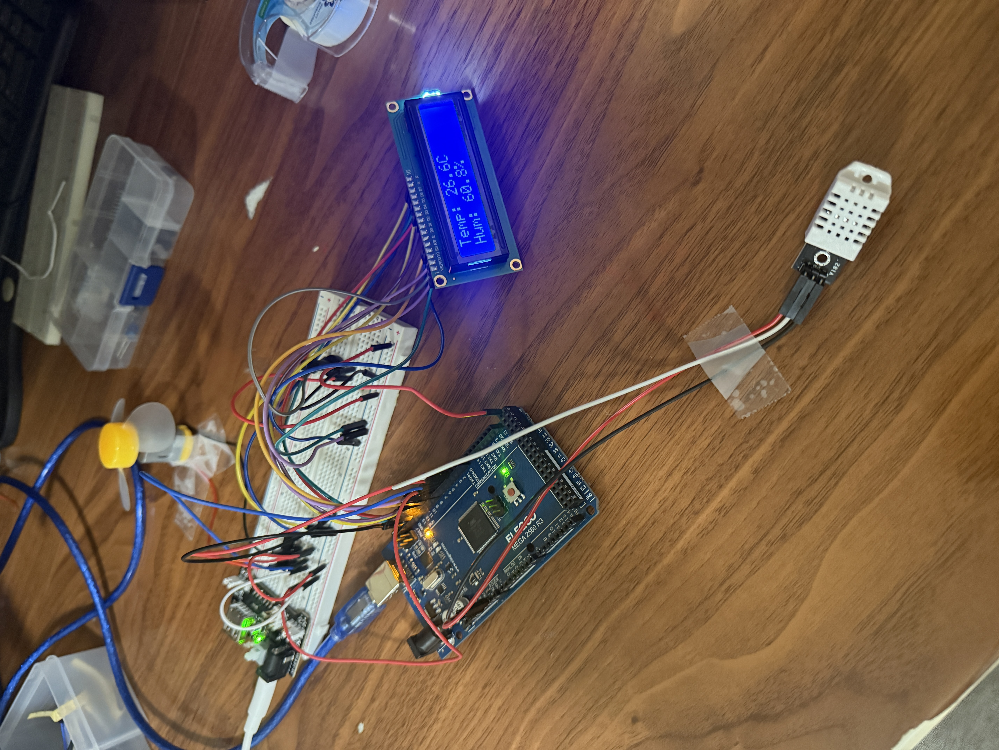
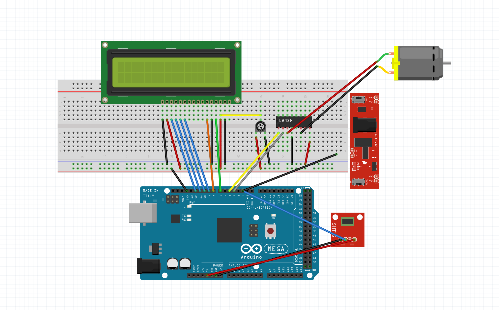

# 🌡️ Temperature-Controlled Fan (Arduino Mega + DHT22 + LCD + L293D)

This project demonstrates how to automatically control a **DC motor (fan)** using an **Arduino Mega 2560**, a **DHT22 temperature & humidity sensor**, a **16x2 LCD**, and the **L293D motor driver**.  

The fan automatically turns on when the temperature rises above **28 °C** and shuts off when it falls below the threshold. Temperature and humidity readings are displayed on the LCD.

---

## 📂 Files in this Repo
- `temp_controlled_fan.ino` → Arduino source code  
- `temp_controlled_fan_diagram.JPG` → real setup photo  
- `temperature_controlled_fan_fritzing.png` → Fritzing wiring diagram  

---

## 🖼️ Demo

### Real Setup


### Fritzing Diagram


---

## 🛠️ Hardware Required
- Arduino Mega 2560 R3 (Elegoo)  
- DHT22 sensor (or DHT11 with code change)  
- 16x2 LCD with potentiometer (for contrast)  
- L293D motor driver IC  
- 3.6V–6V DC motor (used as a fan)  
- MB102 Breadboard Power Supply Module (set to 5V)  
- Breadboard + jumper wires  

---

## 🔌 Wiring Guide

### LCD
| Arduino Mega | LCD Pin  |
|--------------|----------|
| 7            | RS       |
| 8            | E        |
| 9            | D4       |
| 10           | D5       |
| 11           | D6       |
| 12           | D7       |
| GND          | RW, VSS  |
| 5V           | VCC      |
| Pot middle   | VO       |

### DHT22
| Arduino Mega | DHT22 Pin |
|--------------|-----------|
| 2            | DATA      |
| 5V           | VCC       |
| GND          | GND       |

### L293D + Motor
| Arduino Mega | L293D Pin | Description       |
|--------------|-----------|-------------------|
| 3            | IN1       | Motor direction A |
| 4            | IN2       | Motor direction B |
| 5 (PWM)      | EN1       | Motor speed (PWM) |
| 5V           | Vcc1      | L293D logic       |
| 5V (supply)  | Vcc2      | Motor supply (to motor +) |
| Motor lead 1 | OUT1      | Motor terminal    |
| Motor lead 2 | OUT2      | Motor terminal    |
| GND          | GNDs      | Common ground     |

⚠️ Ensure **all grounds (Arduino + Power Supply + L293D) are connected together**.

---

## 💻 Code

```cpp
#include <LiquidCrystal.h>
#include <DHT.h>

// ===== LCD Setup =====
LiquidCrystal lcd(7, 8, 9, 10, 11, 12);

// ===== DHT Setup =====
#define DHTPIN 2
#define DHTTYPE DHT22   // change to DHT11 if using that sensor
DHT dht(DHTPIN, DHTTYPE);

// ===== L293D Motor Setup =====
#define ENABLE 5   // PWM pin
#define DIRA 3     // Motor direction pin A
#define DIRB 4     // Motor direction pin B

// ===== Threshold & Speed =====
const float TEMP_THRESHOLD = 28.0;  // Fan turns on above this temp (°C)
const int FAN_SPEED = 180;          // PWM speed (0–255)

void setup() {
  // LCD + DHT
  lcd.begin(16, 2);
  dht.begin();
  lcd.print("System Ready!");
  delay(2000);

  // Motor pins
  pinMode(ENABLE, OUTPUT);
  pinMode(DIRA, OUTPUT);
  pinMode(DIRB, OUTPUT);

  // Start motor OFF
  digitalWrite(DIRA, LOW);
  digitalWrite(DIRB, LOW);
  analogWrite(ENABLE, 0);

  Serial.begin(9600);
}

void loop() {
  delay(2000); // DHT requires ~2s between reads

  float h = dht.readHumidity();
  float t = dht.readTemperature();

  if (isnan(h) || isnan(t)) {
    lcd.clear();
    lcd.print("Sensor error!");
    Serial.println("Sensor error!");
    return;
  }

  // === LCD Output ===
  lcd.clear();
  lcd.setCursor(0, 0);
  lcd.print("Temp: ");
  lcd.print(t, 1);
  lcd.print("C");

  lcd.setCursor(0, 1);
  lcd.print("Hum: ");
  lcd.print(h, 1);
  lcd.print("%");

  // === Motor Control ===
  if (t > TEMP_THRESHOLD) {
    digitalWrite(DIRA, HIGH);
    digitalWrite(DIRB, LOW);
    analogWrite(ENABLE, FAN_SPEED);
    Serial.println("Fan ON");
  } else {
    digitalWrite(DIRA, LOW);
    digitalWrite(DIRB, LOW);
    analogWrite(ENABLE, 0);
    Serial.println("Fan OFF");
  }
}
