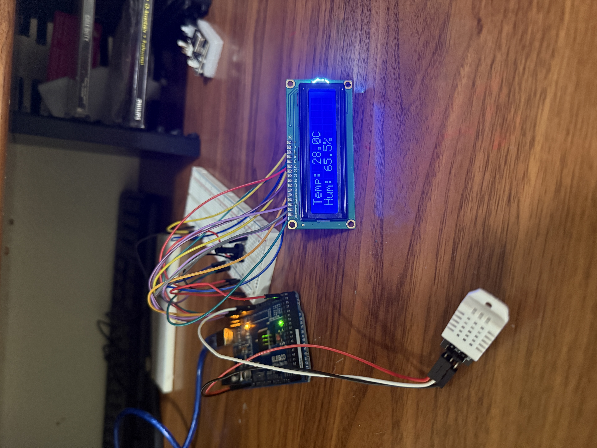
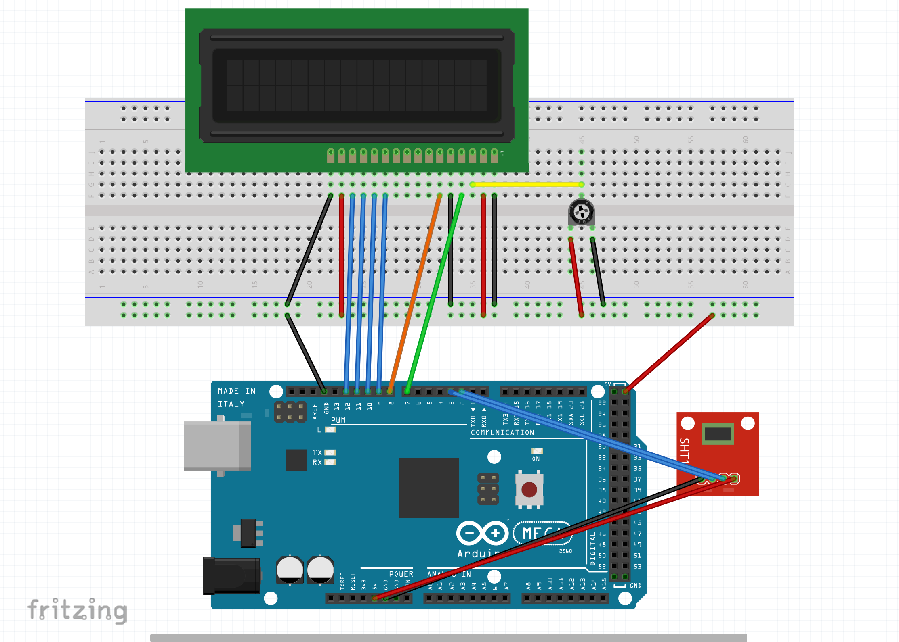

# 🌡️ Temp + Humidity LCD Project (Arduino Mega + DHT11/DHT22)

This project reads **temperature** and **humidity** from a **DHT sensor** (DHT11 or DHT22) and displays the values on a **16x2 LCD** using the Arduino Mega 2560.  
⚠️ Note: the wiring diagram uses an **SHT placeholder** in Fritzing, since the DHT part was not available in the library. Functionality is the same.

---

## 📷 Demo

### Real Setup


### Fritzing Diagram  
*(SHT placeholder used instead of DHT)*  


### Video Demonstration
[Watch Demo](tempoleddemonstation.MOV)

---

## ⚡ Hardware Used
- Arduino Mega 2560 R3 (Elegoo)
- 16x2 LCD with potentiometer for contrast
- DHT11 **or** DHT22 Temperature + Humidity Sensor
- Breadboard + jumper wires

---

## 🔌 Wiring (DHT11/DHT22)
| Arduino Mega Pin | LCD Pin       | DHT Pin   |
|------------------|--------------|-----------|
| 7                | RS           |           |
| 8                | E            |           |
| 9                | D4           |           |
| 10               | D5           |           |
| 11               | D6           |           |
| 12               | D7           |           |
| GND              | RW, VSS, GND | GND       |
| 5V               | VCC          | VCC       |
| 2                |              | DATA      |

---

## 💻 Code

```cpp
#include <LiquidCrystal.h>
#include <DHT.h>

// initialize the LCD (RS, E, D4, D5, D6, D7)
LiquidCrystal lcd(7, 8, 9, 10, 11, 12);

// DHT setup
#define DHTPIN 2       // DHT data pin connected to digital pin 2
#define DHTTYPE DHT22  // change to DHT11 if you are using that sensor
DHT dht(DHTPIN, DHTTYPE);

void setup() {
  lcd.begin(16, 2);   // LCD 16x2
  dht.begin();        // start DHT sensor
  lcd.print("DHT Ready!");
  delay(2000);
}

void loop() {
  delay(2000); // DHT needs ~2s between reads

  float h = dht.readHumidity();
  float t = dht.readTemperature();       // Celsius
  float f = dht.readTemperature(true);   // Fahrenheit

  if (isnan(h) || isnan(t)) {
    lcd.clear();
    lcd.print("Read error!");
    return;
  }

  lcd.clear();

  // Row 1: Temperature
  lcd.setCursor(0, 0);
  lcd.print("Temp: ");
  lcd.print(t, 1);   // Celsius
  lcd.print("C");

  // Row 2: Humidity
  lcd.setCursor(0, 1);
  lcd.print("Hum: ");
  lcd.print(h, 1);
  lcd.print("%");

  // (optional: Fahrenheit)
  // lcd.setCursor(9, 0);
  // lcd.print(f, 1);
  // lcd.print("F");
}
