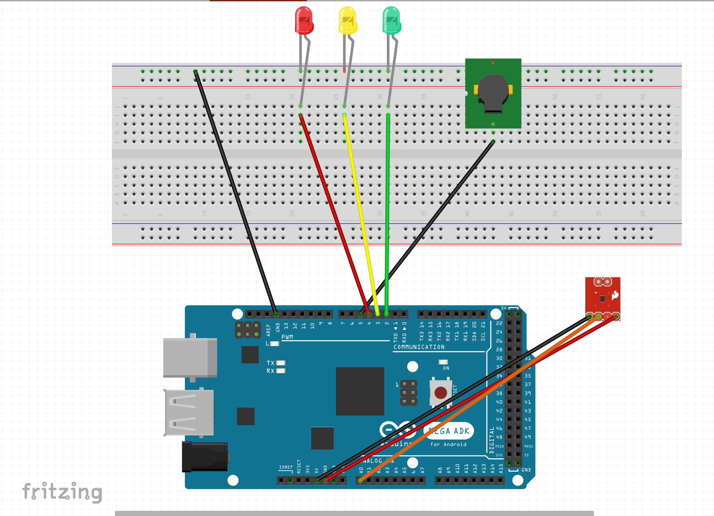
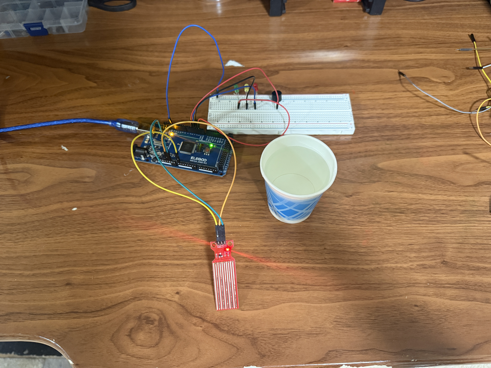

# 💧 Water Level Detector (Arduino)

An Arduino project that measures water level with the Elegoo **Water Sensor Module** and shows status with **green / yellow / red** LEDs. A **buzzer** sounds at high level.

---

## 📦 What’s in this repo

- `waterleveldetector.mov` — demo video  
- `waterleveldetector_fritzing.png` — circuit diagram  
- `waterlevelimage.JPG` — photo of the assembled circuit  
- `waterleveldetector.ino` — Arduino code (see below)

> If your sketch is named differently, that’s fine—just keep it in the repo root.

---

## 🖼️ Circuit



Photo of the build:



---

## 🔧 Parts

- Arduino Uno/Mega  
- Water Level Sensor Module (analogue) → **A0**  
- LEDs: **Green (D2)**, **Yellow (D3)**, **Red (D4)**  
- **Buzzer (D5)**  
- Breadboard + jumpers

**Wiring (quick table)**

| Sensor pin | Arduino |
|---|---|
| S (Signal) | A0 |
| + | 5V |
| – | GND |

LEDs each go from the digital pin through a 220–330 Ω resistor to the LED, then to GND.  
Buzzer `+` → D5, `–` → GND.

---

## 💻 Code

```cpp
const int analogInPin = A0;
int sensorValue = 0;

// LED pins
const int greenLED = 2;
const int yellowLED = 3;
const int redLED = 4;
const int buzzer = 5; // Buzzer pin

// Ranges
const int GREEN_MIN = 50;
const int GREEN_MAX = 200;
const int YELLOW_MIN = 200;
const int YELLOW_MAX = 340;
const int RED_MIN = 340;

void setup() {
  Serial.begin(9600);
  pinMode(greenLED, OUTPUT);
  pinMode(yellowLED, OUTPUT);
  pinMode(redLED, OUTPUT);
  pinMode(buzzer, OUTPUT);
}

void loop() {
  sensorValue = analogRead(analogInPin);
  Serial.print("Sensor = ");
  Serial.println(sensorValue);

  // Turn everything OFF first
  digitalWrite(greenLED, LOW);
  digitalWrite(yellowLED, LOW);
  digitalWrite(redLED, LOW);
  digitalWrite(buzzer, LOW);

  if (sensorValue >= GREEN_MIN && sensorValue < GREEN_MAX) {
    digitalWrite(greenLED, HIGH);
  } 
  else if (sensorValue >= YELLOW_MIN && sensorValue < YELLOW_MAX) {
    digitalWrite(yellowLED, HIGH);
  } 
  else if (sensorValue >= RED_MIN) {
    digitalWrite(redLED, HIGH);
    digitalWrite(buzzer, HIGH);
  }

  delay(100);
}
