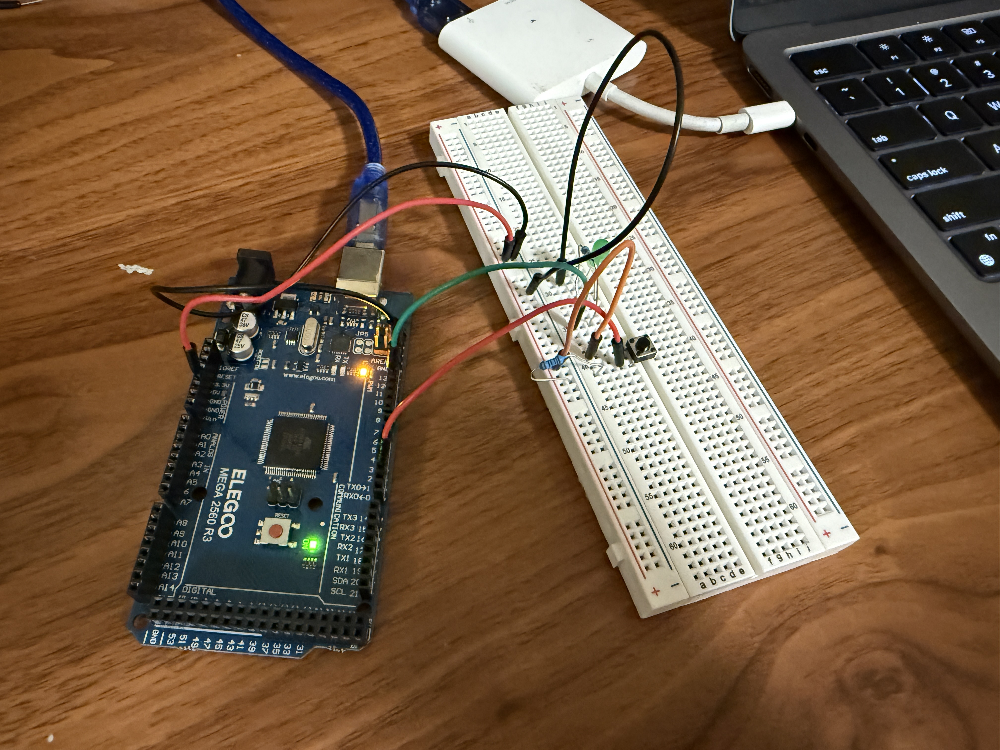

# Button-Controlled LED 💡

## Overview
This is my first Arduino project: pressing a button turns an LED on and off.  
It’s a beginner-friendly introduction to **digital inputs**, **digital outputs**, and how to wire a basic circuit with Arduino.

---

## Media

### Real Circuit Photo
This is my real circuit wired on a breadboard:  


### Demo Video
Here’s the LED working in real life (click to download or view):  
[Button LED Demo](button_led_demonstration.MOV)

### TinkerCAD Simulation (Video)
Beginner-friendly online simulation of the same circuit, recorded from TinkerCAD:  
[Button LED TinkerCAD Demo](button_led_tinkercat.mov)

---

## Components
- Arduino Mega 2560 (Elegoo)  
- 1× Pushbutton  
- 1× LED  
- 1× 220 Ω resistor  
- Jumper wires + breadboard  

---

## Wiring
- Button leg 1 → Pin 2  
- Button leg 2 → GND  
- LED anode (long leg) → resistor → Pin 12  
- LED cathode (short leg) → GND  

---

## Code
Arduino sketch for this project:  
[button_led_script.ino](button_led_script.ino)

```cpp
const int LED_PIN = 12;
const int BUTTON_PIN = 2;

bool ledState = LOW;
bool lastButton = HIGH;

void setup() {
  pinMode(LED_PIN, OUTPUT);
  pinMode(BUTTON_PIN, INPUT_PULLUP);  
  digitalWrite(LED_PIN, ledState);
  Serial.begin(9600);
}

void loop() {
  bool reading = digitalRead(BUTTON_PIN);
  if (lastButton == HIGH && reading == LOW) {
    ledState = !ledState;
    digitalWrite(LED_PIN, ledState);
    Serial.println(ledState ? "LED ON" : "LED OFF");
    delay(200); // debounce
  }
  lastButton = reading;
}
